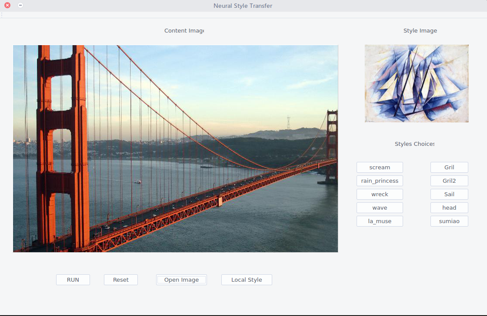
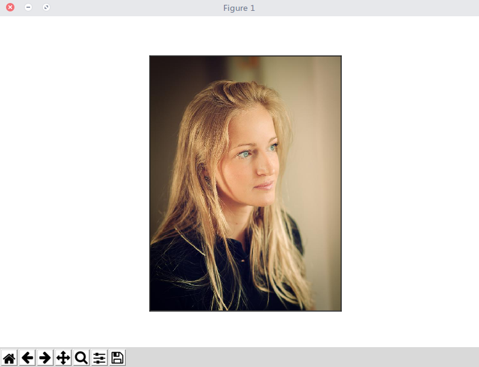
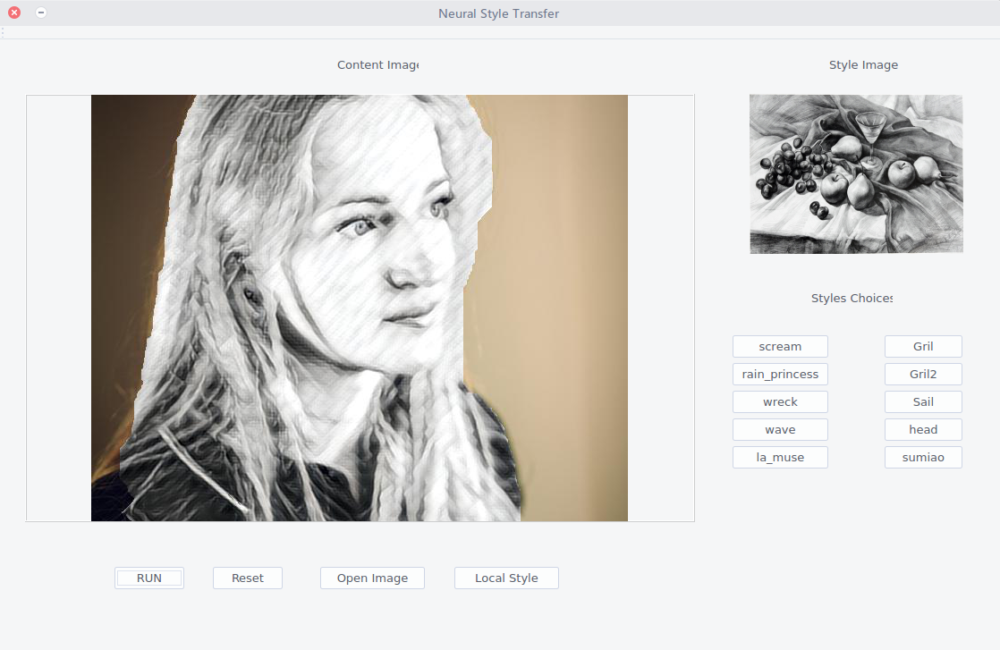
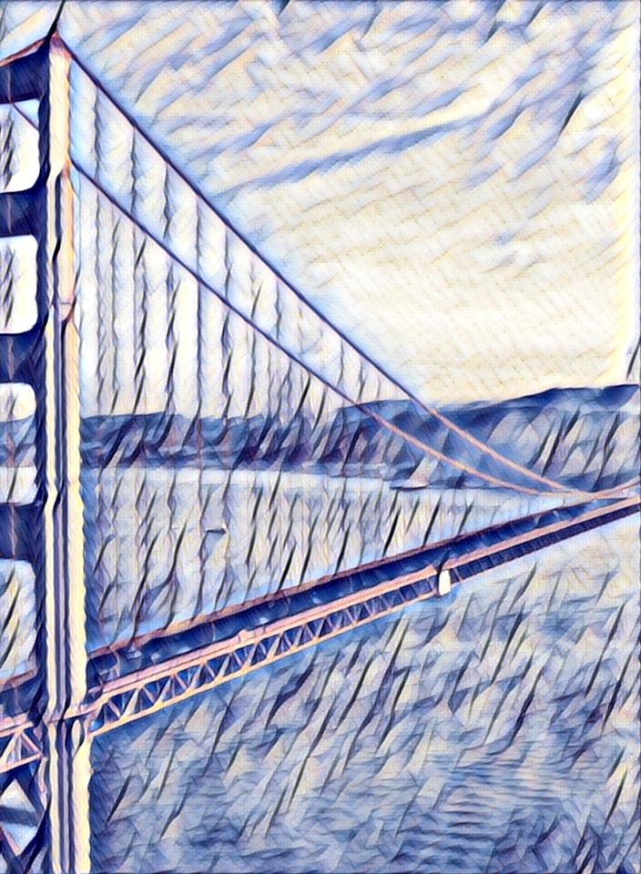
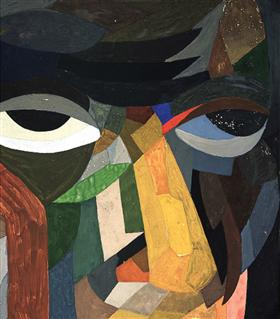
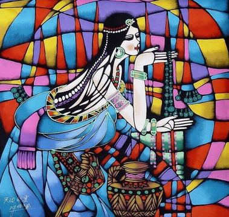
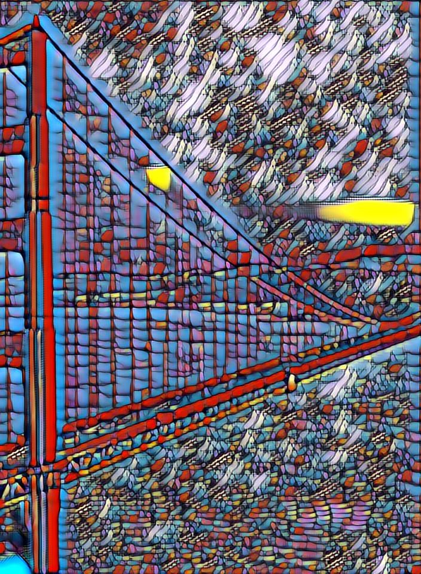
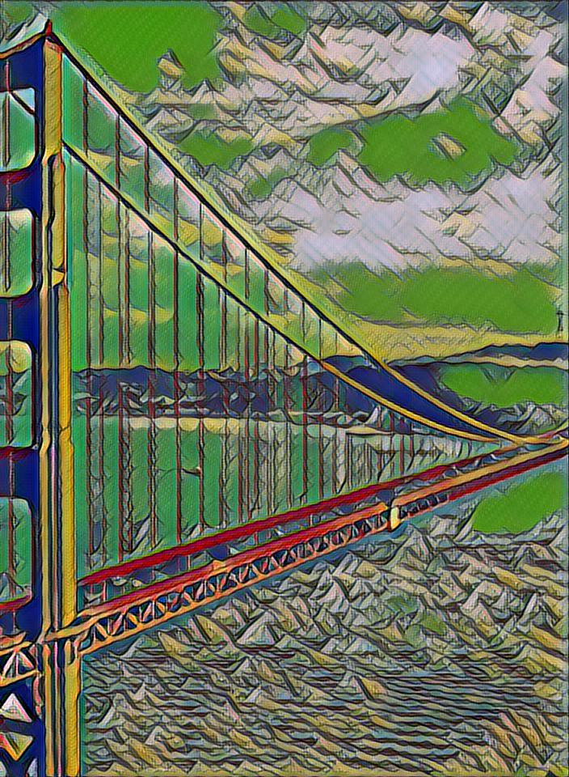
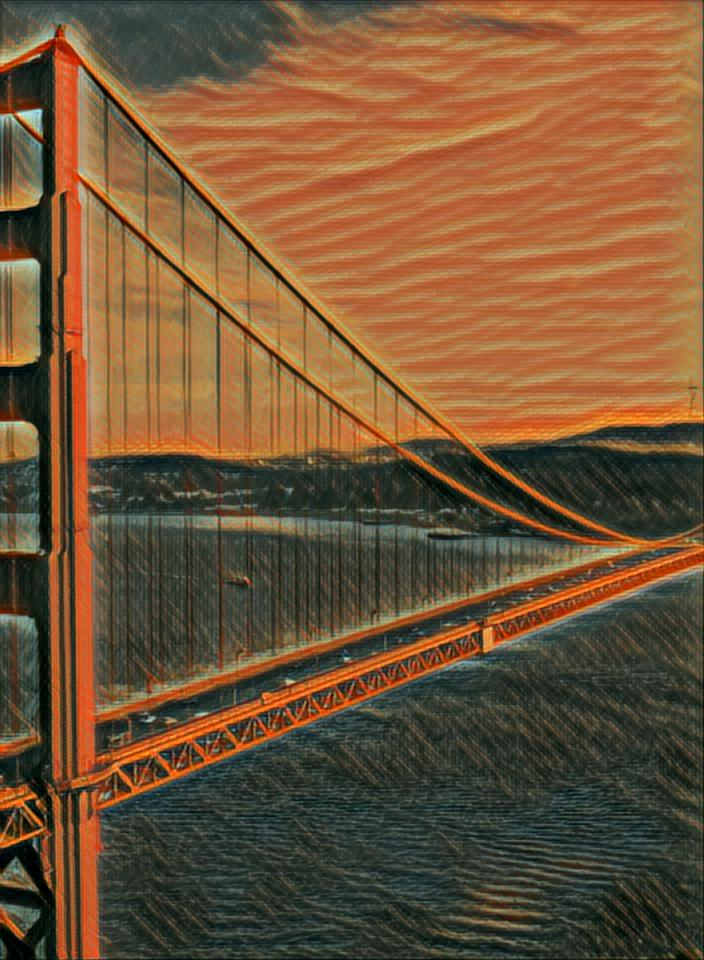
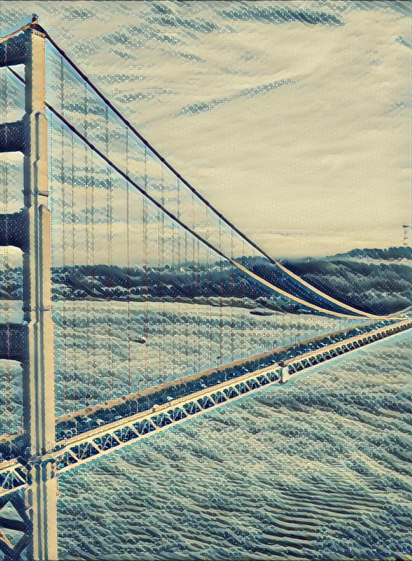

# fast-style-transfer-gui

## fast-style-transfer　

A GUI application for [fast-style-transfer](http://cs.stanford.edu/people/jcjohns/eccv16/), also add local style transfer by graghcut which is a algorithm in opencv．　　

This code test on ubuntu 15.04, gcc4.8.5.

Dependencies：　　
* opencv3.1  
* scikit-image(0.11.3)  
* PyQt
* mxnet(>0.9.5)  
* numpy(1.12.1)  
* matplotlib  


First you need to install anaconda, which will help you config enviroments quickly and easily：
#### opencv3.1  

```
conda install -c https://conda.binstar.org/menpo opencv
```

#### PyQt  

```
conda install pyqt
```

#### mxnet, numpy, matplotlib, scikit-image

```
pip install mxnet
pip install numpy
pip install matplotlib
pip install scikit-image
```

### How to run?　　

After installing dependencise，run following command in current directory：　　

```
python main.py
```

and there will be a GUI showing as following：　　

    

#### GUI   
　　

Buttons in area of style choices are for style choices, such as sail, head .etc， and area in style image will show the style for the choice；After that, click "open image" button to open a content image，and the image will shows in area of content image; and the content image will show in the area, click "RUN" to get outputs, which will be saved to "out" dir in current dir．　　

For local style transfer，you can click button "local style" after you choose content image, and will get a dialog showed as following ：　　


  

click two position in image，e.g. left-top and right-bottom，which namely get a rectangle in image，click "RUN", get the outputs as above we mentioned：　　

  

### pre-traned model  

There are 12 pretrained models in [baidu cloud driver](https://pan.baidu.com/s/1jItB2yM), you can download them and unzip into current dir.  styles show as follows:    

<div align='center'>

</div>

<div align = 'center'>
<a href = 'out/golden_gate.jpg'></a>


<a href = 'styles/udnie.jpg'></a>
<br>
<a href = 'out/golden_gate.jpg'></a>


<a href = 'styles/udnie.jpg'></a>

<br>
<a href = 'out/golden_gate.jpg'></a>


<a href = 'styles/udnie.jpg'></a>
</div>

### TODO　  

* Rerun will request more memory because memory for model created by mxnet cannot free well  
* Segmentation needs to optimaze.  

### Thanks 

[zhaw/neural_style](https://github.com/zhaw/neural_style/tree/master/perceptual)  
[lengstrom/fast-style-transfer](https://github.com/lengstrom/fast-style-transfer)


